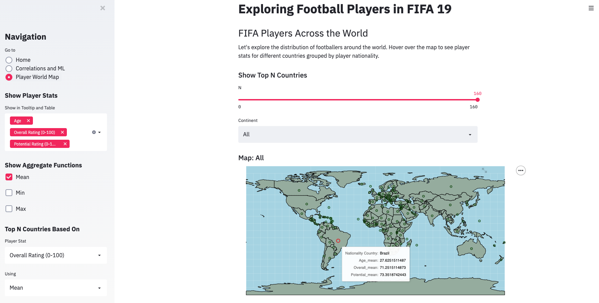

# Exploring Football Players in FIFA 19

Association football (soccer) is undeniably the most popular sport in the world. In this project, we create interactive 
visualizations that enable users to explore a dataset of players from <i>FIFA 19</i>, a football simulation video game. By 
interacting with our visualizations, users can learn about the attributes that make up a valuable football player, the 
correlations between player attributes (e.g. sport-specific skills, general measures of athletic ability, etc.), and how
players from different countries around the world compare. More detail on these, along with specific sample questions, 
are provided in the Project Goals section below.

## Project Goals

Motivated by a shared interest in sports and data analysis, we chose to explore a complete dataset of the players in FIFA 19, a football simulation video game. This data was sourced from [Kaggle](https://www.kaggle.com/karangadiya/fifa19) and provided by Karan Gadiya, a Master’s student studying Data Science at the University of Virginia.

We selected this dataset because it provides a comprehensive list of information (e.g. different skill statistics, ratings, demographic details, and estimated monetary values) for all of the players. 

Though it’s difficult to reduce everything about every player down to a simple card of stats, EA Sports (the developers behind FIFA 19) put [a considerable effort](https://www.fifplay.com/how-accurate-are-fifa-ratings-compared-to-real-life-stats/) into collecting and maintaining their database of player information. As mentioned in the linked article, they employ a team of 25 EA producers, 400 outside data contributors, and 6000 volunteer FIFA Data Reviewers (composed of talent scouts, coaches, and fans around the world). This diverse and knowledgeable well of information makes the player stats in FIFA 19 credible and supports the use of this data to conduct our analysis.

In this project, we create interactive visualizations that enable users to learn more about the player data and demonstrate how we use them to answer the following questions:

1. What are the correlations between different player attributes?
  * Overall Rating vs Wage: Correlation of .63; there are many significant outliers on the wage scale. Neymar and Messi make way more money than most players.
  * Age vs Overall Rating: Correlation of .45; relationship isn’t constant, it’s positive until about age 29-30, then negative (i.e. players get better until about age 30 then start to decline)
  * Aggression vs Penalties: Correlation of .34. Interestingly, there are two main clusters, and not many players have a “Penalties” value between 25 and 35.
  * Ball Control vs Dribbling: Correlation of .55. Not many players have a “Ball Control” value between 25 and 45.
  * Ball Control vs Finishing: Correlation of .79. A strong linear relationship.
2. What attributes are the most predictive of a player’s overall rating (using ML)? 
  * The player’s wage is a strong indicator of their overall rating (MSE of 9.59). When you add the players “Potential” and their age, the classifier is very good (MSE of 1.57). This could be because players with lower wages can still have a good overall rating if they are young and on a rookie contract.

## Design

### Interactive Correlation Plots

<b>How to Interact</b>

This visualization allows users to explore the relationship between certain player attributes. The user selects two of the quantitative variables in the dataset and the app will output their correlation, as well as a plot of the two variables with a fitted regression line. Users may also select a third variable to represent the point color on the plot if they wish. The resulting plot has a hover feature that will show the name and the position of the player that point represents.

<b>Design Process and Rationale</b>

Given the large number of variables, I thought this would be an effective way for users to explore the dataset and get a feel for the different variables and how they’re related. Additionally, given the high concentration of points in the plot, I thought having a low opacity for the points made sense, since this makes it easier to see which areas have a lot of points in them.

### Machine Learning Tool

<b>How to Interact</b>

Users can select a target variable, and one or more predictor variables from the dataset. The application will build a regression model using the selected variables, and output the mean squared error on a testing data set, as well a residual plot from the classifier.

<b>Design Process and Rationale</b>

We thought it would be cool to let users see how well attributes of players can be predicted given other attributes. This also builds off of the last visualization and lets users continue their exploration into the relationship between variables. I thought including a residual plot would allow users to see how well the model does over different values of the target variables, which is a very important feature of a machine learning model. The plot is also easy to interpret.

### Player World Map

<b>How to Interact</b>

Users can select how many markings for the top N countries are shown on the world map, where the player statistic, aggregate function, and order for determining top countries can be configured by interacting with dropdowns on the sidebar. An example configuration might be to show the top 50 countries (player nationalities) based on their average player overall ratings in descending order (highest to lowest). 

When users hover over a country marking on the map, the marking changes from a small green circle to a larger red circle and a tooltip appears next to their cursor that displays the country’s name and additional aggregate player stats that can be selected in the sidebar. Examples of player stats include Age, Overall Rating (0-100, Potential Rating (0-100), and Value. The available aggregate functions to use are mean, min, and max. 

Users can choose to zoom into a specific continent by selecting its name in the dropdown above the world map. This is useful in cases where countries are very small and packed together. For example, Europe is the smallest continent but is also composed of many small countries that produce many top football players. When they select Europe in the dropdown, they zoom into Europe and see which regions produce players that satisfy a specific attribute (e.g. highest Overall Rating or Wage/Week (€))

<b>Design Process and Rationale</b>

Some of our initial exploration questions involved comparisons among players of different nationalities. As a result, we chose to create an interactive world map to allow users to learn about how different countries compare based on different aggregate player statistics.

The design of this interactive map was inspired and created by blending elements from examples on the Altair documentation site, specifically the [World Map](https://altair-viz.github.io/gallery/world_map.html) and the [Locations of US Airports map](https://altair-viz.github.io/gallery/airports.html), which showed tooltips for the airport name, city, and state for airports in the US.

Initially, we chose to show a spherical globe (orthographic) for the world map, but later decided that the equirectangular map would allow users to see all of the countries at once and compare them side-by-side. 

Our initial implementation had marks that changed from small black circles to larger black circles when they were hovered over. However, many small black circles in close proximity produced a cluttered look when showing markings for all of the countries in the dataset. Using the same color on hover also made it difficult to see exactly where the user’s cursor was hovering over on the map. We changed these to small green circles and larger red circles (on hover), respectively. The green is slightly darker than the green used to color in the countries on the map; this allows users to see the small circles marking the different countries but prevents them from becoming too distracting. The large red circle stands out in large contrast against the green on the map, allowing users to clearly see which country they were hovering over.

Lastly, we moved the multiselect dropdown for specifying which player stats to show, the checkboxes for selecting which aggregate functions to use, and the dropdowns to configure how to determine the Top N Countries to the sidebar so they would not take up too much room or be visually overwhelming to the user on the main portion of the screen. This also allows their focus to stay on the world map.

## Development

### Player World Map

To create the interactive Player World Map we used the original FIFA 19 players dataset from Kaggle and a Countries dataset containing geographic information on countries around the world from Google’s Dataset Publishing Language repository. We found that we needed the Countries dataset to plot the data points on the world map since the original dataset did not contain latitude and longitude information for the countries of player’s nationalities.

We needed to do some data cleaning to merge the 2 datasets. The Countries dataset was initially missing 26 countries from the Nationality column in the FIFA 19 dataset. On closer inspection, all but 1 of these discrepancies were due to differences in naming convention (e.g. specifying the individual countries England, Scotland, Wales, and Northern Ireland instead of listing them as United Kingdom or using different symbols and abbreviations). We created a new column in the FIFA 19 dataset ‘Player Nationality’ that was a copy of the ‘Nationality’ column, except it used the Countries dataset naming convention. The only Nationality that we did not have geographic information for was Curaçao; we found its geographic coordinates on Google and added it to the dataset manually.

### Additional Info

<b>Estimated Time Spent Developing App</b>
40 hours

<b>Aspects that took the most time:</b>
* Figuring out how to use Altair and Streamlit
* Finding and integrating the GPS coordinate information for the different countries (data cleaning to get the naming conventions used in both datasets to match)
* Adding the zoom feature that allows users to zoom into a specific continent on the map since Altair’s maps currently do not support the .interactive() function

<b>Division of Work:</b>

We divided our work by taking on different interactive visualizations and meeting regularly to consult each other for feedback and new ideas.

* Correlation Plots and Machine Learning Tool (James)
* Player World Map (Vivian)
